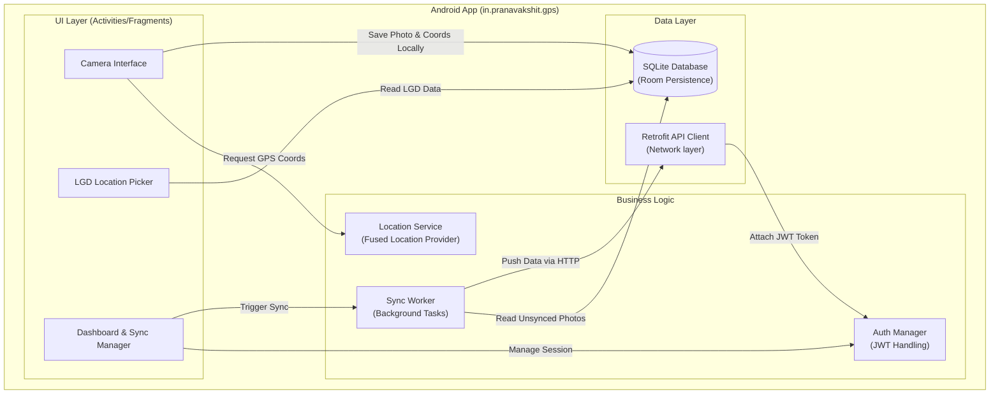

# Android Architecture Diagram

```mermaid
flowchart TD
    subgraph App["Android App (in.pranavakshit.gps)"]
        subgraph UI["UI Layer (Activities/Fragments)"]
            CameraUI["Camera Interface"]
            LocationPicker["LGD Location Picker"]
            DashboardUI["Dashboard & Sync Manager"]
        end
        
        subgraph Logic["Business Logic"]
            LocationService["Location Service\n(Fused Location Provider)"]
            SyncWorker["Sync Worker\n(Background Tasks)"]
            AuthManager["Auth Manager\n(JWT Handling)"]
        end
        
        subgraph Data["Data Layer"]
            ApiClient["Retrofit API Client\n(Network layer)"]
            SQLite[("SQLite Database\n(Room Persistence)")]
        end
    end
    
    CameraUI -->|Request GPS Coords| LocationService
    LocationPicker -->|Read LGD Data| SQLite
    CameraUI -->|Save Photo & Coords Locally| SQLite
    DashboardUI -->|Manage Session| AuthManager
    DashboardUI -->|Trigger Sync| SyncWorker
    SyncWorker -->|Read Unsynced Photos| SQLite
    SyncWorker -->|Push Data via HTTP| ApiClient
    ApiClient -->|Attach JWT Token| AuthManager
```
