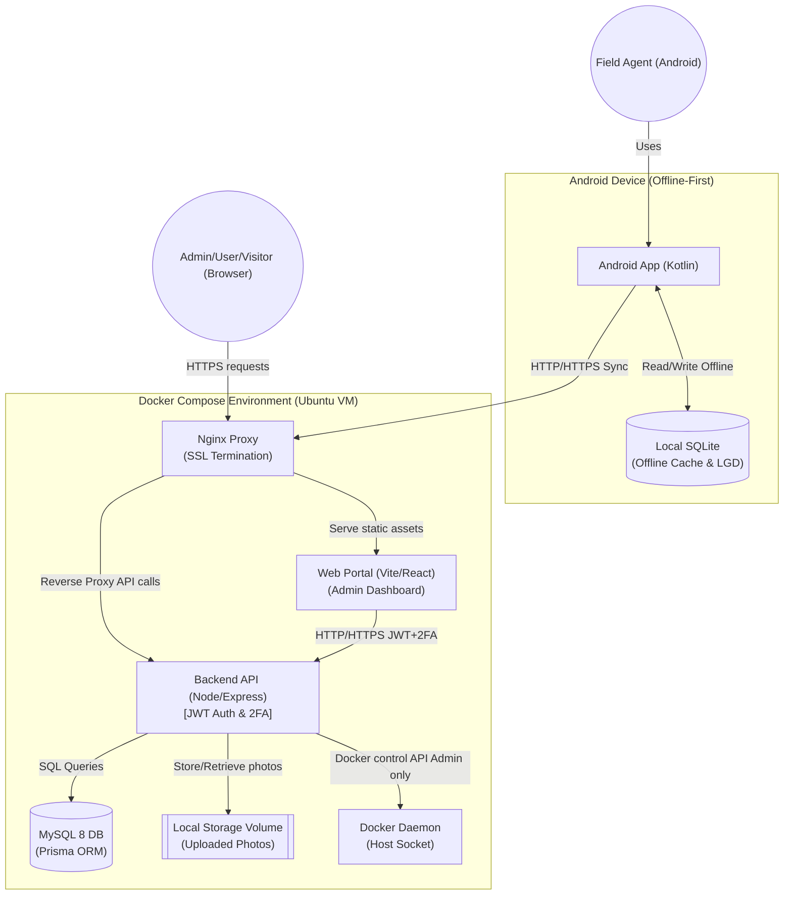

# System Architecture Diagram

```mermaid
flowchart TD
    Agent(("Field Agent (Android)"))
    PortalUser(("Admin/User/Visitor (Browser)"))

    subgraph Android["Android Device (Offline-First)"]
        MobileApp["Android App (Kotlin)"]
        LocalDB[("Local SQLite\n(Offline Cache & LGD)")]
    end

    subgraph Docker["Docker Compose Environment (Ubuntu VM)"]
        Nginx["Nginx Proxy\n(SSL Termination)"]
        Web["Web Portal (Vite/React)\n(Admin Dashboard)"]
        Backend["Backend API (Node/Express)\n[JWT Auth & 2FA]"]
        DB[("MySQL 8 DB\n(Prisma ORM)")]
        Storage[["Local Storage Volume\n(Uploaded Photos)"]]
        DockerSock["Docker Daemon\n(Host Socket)"]
    end

    Agent -->|Uses| MobileApp
    MobileApp <-->|Read/Write Offline| LocalDB
    MobileApp -->|HTTP/HTTPS Sync| Nginx

    PortalUser -->|HTTPS requests| Nginx
    Nginx -->|Serve static assets| Web
    Nginx -->|Reverse Proxy API calls| Backend

    Web -->|HTTP/HTTPS JWT+2FA| Backend
    Backend -->|SQL Queries| DB
    Backend -->|Store/Retrieve photos| Storage
    Backend -->|Docker control API Admin only| DockerSock
```
