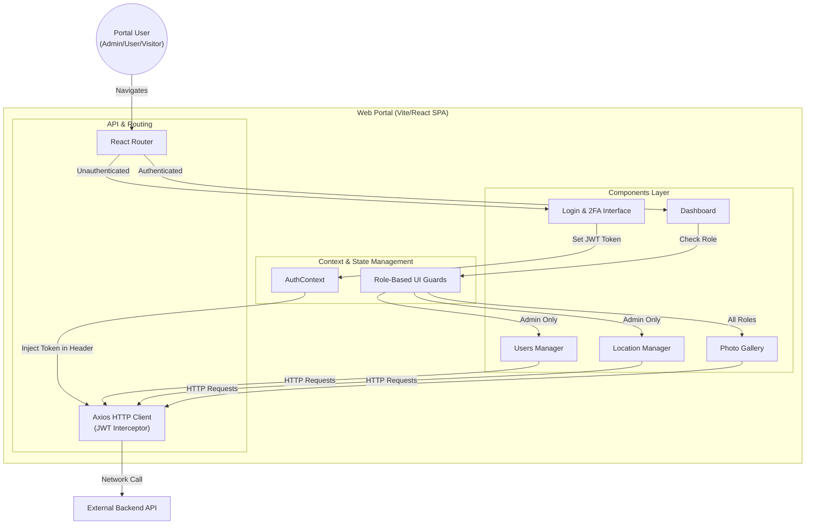

# Web Portal Architecture

```mermaid
flowchart TD
    User(("Portal User\n(Admin/User/Visitor)"))
    
    subgraph Web["Web Portal (Vite/React SPA)"]
        subgraph UI["Components Layer"]
            Dashboard["Dashboard"]
            Gallery["Photo Gallery"]
            LocationManager["Location Manager"]
            UsersManager["Users Manager"]
            LoginUI["Login & 2FA Interface"]
        end
        
        subgraph State["Context & State Management"]
            AuthContext["AuthContext"]
            UI_Guards["Role-Based UI Guards"]
        end
        
        subgraph API["API & Routing"]
            Router["React Router"]
            Axios["Axios HTTP Client\n(JWT Interceptor)"]
        end
    end
    
    External["External Backend API"]
    
    User -->|Navigates| Router
    Router -->|Unauthenticated| LoginUI
    Router -->|Authenticated| Dashboard
    Dashboard -->|Check Role| UI_Guards
    UI_Guards -->|Admin Only| UsersManager
    UI_Guards -->|Admin Only| LocationManager
    UI_Guards -->|All Roles| Gallery
    
    LoginUI -->|Set JWT Token| AuthContext
    AuthContext -->|Inject Token in Header| Axios
    UsersManager -->|HTTP Requests| Axios
    LocationManager -->|HTTP Requests| Axios
    Gallery -->|HTTP Requests| Axios
    
    Axios -->|Network Call| External
```
